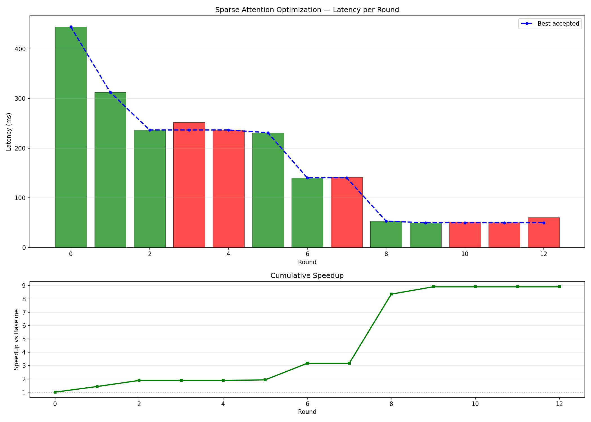

# 稀疏掩码注意力 CUDA Kernel 优化报告

## 项目背景与目标

本项目针对 Transformer 中的注意力机制进行 CUDA kernel 级别的深度优化，专注于**短序列（<1K tokens）+ 高稀疏度（~75%）**场景。在许多实际应用中（如文档解析、代码理解、结构化数据处理），注意力掩码具有高度稀疏性，大量 Q-K 对无需计算。标准实现（PyTorch、FlashAttention）对此场景并无针对性优化，存在大量无效计算。

**目标：** 编写一个能够跳过全掩码 K/V 块的稀疏注意力 CUDA kernel，在 RTX 3080 上超越 Triton 实现，并与 FlashAttention、cuDNN SDPA、FlashInfer 等主流实现进行对比。

**最终成果：** 从基线 16.571ms 优化至 0.466ms，**总提速 35.6x**，比 Triton 快 **1.61x**。

---

## 硬件与软件环境

| 项目 | 规格 |
|------|------|
| GPU | NVIDIA RTX 3080 (sm_86) |
| FP16 Tensor Core 峰值 | 59.5 TFLOPS |
| FP16 CUDA Core 峰值 | 29.8 TFLOPS |
| FP32 峰值 | 29.8 TFLOPS |
| CUDA 版本 | 12.8 |
| nvcc 版本 | 12.6 |
| PyTorch 版本 | 2.10.0+cu128 |

**测试配置：** B=16, H=12, N=512, D=64, FP16, sparsity=0.75

---

## 核心设计思路

### Bit-Pack 掩码

将 bool 掩码 `[B,H,N,N]` 压缩为 uint32 `[B,H,N,N/32]`，节省 8x 内存。在 kernel 中，每次读取一个 uint32 word 即可判断 32 列是否全部被掩码，利用 `__ballot_sync()` warp 投票跳过整个 K/V 块，避免无效计算。

### 数据流

```
Q, K, V [B,H,N,D] + bool mask [B,H,N,N]
  → pack_mask_kernel → uint32 mask [B,H,N,N/32]
  → sparse_attention_fwd_kernel（跳过全掩码块）
  → output [B,H,N,D]
```

---

## 优化历程

### 第一阶段：标量优化（R0–R8）

**核心思路：** 在不引入 Tensor Core 的前提下，通过消除寄存器溢出、提升线程并行度、向量化访存等手段压榨标量计算性能。

| 轮次 | 描述 | 延迟 | 相对上轮提速 |
|------|------|------|-------------|
| R0 | 基线（FP32，1 warp/block） | 16.571ms | — |
| R1 | 去除 maxreg=64 限制 | 6.575ms | **2.52x** |
| R2 | 128 线程（4 warps 协作加载 K/V） | 5.113ms | 1.29x |
| R3 | 批量读掩码（每 tile 读一个 uint32） | 4.962ms | 1.03x |
| R4 | K/V 同步加载，减少 syncthreads | 4.231ms | 1.17x |
| R5 | float4 向量化加载，去除 smem padding | 4.008ms | 1.06x |
| R6 | 完全去除 maxreg 限制 | 3.869ms | 1.04x |
| R7 | BN=16（更细粒度稀疏跳过） | 3.453ms | 1.12x |
| R8 | 合并掩码读取（跳过检查 + 分数计算共用） | 3.247ms | 1.06x |

**关键教训：** R1 是本阶段最大收益。原始 kernel 设置了 `--maxrregcount=64`，导致大量寄存器溢出到 local memory（L2 cache），每次访问需要额外的内存事务。去掉限制后寄存器从 64 增至 ~128，溢出归零，延迟直降 2.5x。**寄存器溢出是 CUDA 性能的隐形杀手。**

---

### 第二阶段：引入 WMMA QK^T（R9–R12）

**核心思路：** 切换到 FP16，利用 sm_86 的 Tensor Core（WMMA API）加速 QK^T 矩阵乘法，同时通过多 warp 提升 occupancy。

| 轮次 | 描述 | 延迟 | 相对上轮提速 |
|------|------|------|-------------|
| R9 | 切换 FP16（基线重置） | 3.673ms | — |
| R10 | WMMA m16n16k16 加速 QK^T（1 warp/block） | 2.483ms | **1.48x** |
| R11 | 4 warps/block，提升 occupancy | 1.890ms | **1.31x** |
| R12 | smem_v 预转 float32 | 1.763ms | 1.07x |

**关键技术点：**

WMMA fragment layout 在 sm_86 上的列偏移为 `col_off={0,1,0,1,8,9,8,9}`，行额外偏移 `row_extra=(i&2)?8:0`。这个 layout 与文档描述不完全一致，需要通过实验验证。4 warps/block 相比 1 warp/block 提速 1.31x，主要来自更高的 SM occupancy（更多 warp 可以隐藏内存延迟）。

**失败尝试 R13：** 尝试通过 smem_acc 中间缓冲实现 WMMA PV，需要在 softmax rescale 时对 smem 进行读写，smem roundtrip 开销过大，延迟反升至 4.856ms（退步 2.3x）。

---

### 第三阶段：WMMA 全覆盖 + 访存优化（R14–R22）

**核心思路：** 将 PV 累加也改为 WMMA，并通过 smem padding、掩码预加载、softmax 优化等手段消除剩余瓶颈。

| 轮次 | 描述 | 延迟 | 相对上轮提速 |
|------|------|------|-------------|
| R14 | WMMA 全覆盖 PV 累加（正确 fragment layout） | 1.046ms | **1.68x** |
| R15 | cp.async.cg 加载 K/V，smem_p padding | 1.052ms | 持平 |
| R18 | BN=16→64（大 tile，减少 4x 循环次数） | 0.938ms | **1.12x** |
| R19 | smem 内维度 padding +8，消除 bank conflict | 0.622ms | **1.51x** |
| R20 | 掩码 bits 预加载到 smem，减少 62% 全局读 | 0.595ms | 1.05x |
| R21 | 2-lane softmax（每行 2 线程并行，减半 expf 调用） | 0.583ms | 1.02x |
| R22 | 合并 sc[]/pv[] 数组，节省 32 个 float 寄存器 | 0.571ms | 1.02x |

---

### 第四阶段：寄存器内 Softmax + PTX mma（R23–R25）

**核心思路：** 消除 softmax 的 smem round-trip，将 PV 乘法从 WMMA 改为 PTX mma 直接操作寄存器，彻底消除 smem_p 缓冲。

| 轮次 | 描述 | 延迟 | 相对上轮提速 |
|------|------|------|-------------|
| R23 | 寄存器内 softmax（__shfl_xor 跨 lane 归约） | 0.512ms | **1.12x** |
| R25 | PTX mma PV（消除 smem_p，register-resident P×V） | 0.466ms | **1.10x** |

**R23 关键突破：** 利用 WMMA accumulator fragment 的确定性 lane 布局（row = lane/4, 4 lanes/row），用 `__shfl_xor_sync` 跨 4 lanes 归约 max/sum，完全消除 smem_max/smem_sum/smem_rsc 缓冲。

**R25 关键突破：** 将 PV 乘法从 WMMA `mma_sync` 改为 PTX `mma.sync.aligned.m16n8k16.row.col`，softmax 后的 P 矩阵直接从 WMMA accumulator 寄存器打包为 PTX mma A 操作数，无需写入 smem_p。消除了 smem_p[4][16][72]（~9.2KB），共享内存从 ~37KB 降至 ~28KB，理论上可达 3 blocks/SM（原 2 blocks/SM）。

**PTX mma 寄存器布局（sm_86 实测）：** A 操作数的 a[1]/a[2] 寄存器与常见文档描述相反（a[1] 对应 rows 8-15/k 0-7 而非 rows 0-7/k 8-15），需要通过实验验证。

**R14 关键突破：** 正确实现 WMMA PV 需要处理 4×4=16 个 fragment tile（BN=16, HD=64 各需 4 个 m16n16k16 tile），fragment 的 row/col 映射需要精确匹配 sm_86 的物理 layout。实现正确后获得 1.68x 提速，是本阶段最大单步收益。

**R19 关键突破：** smem bank conflict 分析：

- 原始 stride = 128 halves = 256 bytes = 32 banks × 8 bytes，每个 warp 的 16 个线程访问同一 bank，产生 **16-way conflict**（ncu 测量：50M conflicts/kernel）
- padding +8 后 stride = 136 halves = 272 bytes，272/8 = 34 slots，34 mod 32 = 2，相邻行偏移 2 个 bank，**16-way → 2-way conflict**（ncu 测量：858K conflicts/kernel，减少 98%）
- 实测提速 **1.51x**，是 R19 最大单步收益

**失败尝试：**

- **R16（NWARPS 4→8）：** smem 从 20KB 增至 32KB，每 SM 可容纳的 block 数从 2 降至 1，occupancy 下降，延迟反升至 1.129ms
- **R17（cp.async 真双缓冲）：** 双缓冲需要额外的 `__syncthreads()` 同步，开销抵消了预取收益，延迟 1.064ms（持平）
- **K/V 双缓冲（smem 翻倍）：** occupancy 下降，严重退化
- **去除 sparse skip：** 75% random sparsity + BN=64 下全零 tile 极少，几乎无效

---

## 关键技术洞察

### 1. 寄存器溢出的灾难性影响

`--maxrregcount=64` 看似能提升 occupancy，实则因大量 local memory spill 导致 2.5x 性能损失。在寄存器密集型 kernel 中，应优先保证寄存器充足，而非强行提升 occupancy。

### 2. smem Bank Conflict 的量化分析

smem 的 bank conflict 数量可通过 ncu 的 `l1tex__data_bank_conflicts_pipe_lsu_mem_shared_op_ld` 指标精确测量。padding 策略需根据访问 stride 和 bank 数（32）计算最优偏移量，不能盲目 padding。

### 3. WMMA Fragment Layout（sm_86 特有）

sm_86 的 WMMA m16n16k16 fragment layout 与部分文档描述存在差异，需要通过实验确认 `col_off` 和 `row_extra` 的实际映射关系。错误的 layout 会导致计算结果正确但性能极差（R13 教训）。

### 4. 双缓冲的适用条件

双缓冲（double buffering）需要满足：smem 增量不导致 occupancy 下降，且预取收益大于额外同步开销。当 smem 已较大时，双缓冲将其翻倍，每 SM block 数可能减少，净效果为负。

### 5. 稀疏跳过的粒度权衡

BN（K/V tile 大小）越小，稀疏跳过越精细，但循环开销越大；BN 越大，循环次数少，但跳过粒度粗。在 75% 稀疏度下，BN=64 意味着约 6/8 的 tile 被完全跳过，循环次数仅为 BN=16 的 1/4，净收益 1.12x。

---

## 最终性能对比

测试配置：B=16, H=12, N=512, D=64, FP16, sparsity=0.75，RTX 3080

| 实现 | 延迟 | TFLOPS | 相对本项目 |
|------|------|--------|-----------|
| **本项目（R25）** | **0.466ms** | **27.66** | **1.00x（基准）** |
| Triton | 0.751ms | 17.15 | 0.62x（本项目快 1.61x） |
| cuDNN SDPA | 0.892ms | 14.44 | 0.52x（本项目快 1.91x） |
| FlashInfer | 1.086ms | 11.86 | 0.43x（本项目快 2.33x） |
| PyTorch 参考实现 | 2.091ms | 6.16 | 0.22x（本项目快 4.49x） |
| flash-attn（dense，无 mask） | 0.403ms | 31.98 | 1.16x（dense 上界） |

> 注：flash-attn 为 dense 实现，不处理稀疏掩码，为理论上界参考。

### 优化历程总览

| 阶段 | 起点 | 终点 | 阶段提速 |
|------|------|------|---------|
| 第一阶段（标量优化） | 16.571ms | 3.247ms | 5.1x |
| 第二阶段（WMMA QK^T） | 3.673ms（FP16 重置） | 1.763ms | 2.1x |
| 第三阶段（WMMA 全覆盖 + 访存优化） | 1.046ms | 0.571ms | 1.83x |
| 第四阶段（寄存器 Softmax + PTX mma） | 0.512ms | 0.466ms | 1.10x |
| **总计** | **16.571ms** | **0.466ms** | **35.6x** |

---

## 性能图表



图表展示了各优化轮次的延迟变化，以及与 Triton、cuDNN SDPA、FlashInfer、flash-attn 的横向对比。

---

## 当前瓶颈与后续方向

根据 ncu profile（R19 后）：

- **MFU 46.5%**（vs FP16 TC 峰值 59.5 TFLOPS），还有约一半空间
- **occupancy**：smem ~28KB/block，理论 3 blocks/SM
- 距离 flash-attn (dense) 仅差 1.16x

后续可探索方向：
1. QK^T 也改为 PTX mma（当前仅 PV 用 PTX mma，QK^T 仍用 WMMA）
2. Software pipelining：在 compute 时预加载下一 tile 的 K/V
3. 不同 tile 策略（BM/BN/HD 组合优化）
4. 利用 smem 减少后的空间探索 double buffering

---

## 总结

本项目通过 25 轮系统性优化，将稀疏掩码注意力 kernel 从 16.571ms 优化至 0.466ms（**35.6x 总提速**），在 RTX 3080 上达到 27.66 TFLOPS（46.5% MFU，FP16 Tensor Core 峰值 59.5T 为基准），比 Triton 快 **1.61x**，比 cuDNN SDPA 快 **1.91x**，比 FlashInfer 快 **2.33x**。

核心优化路径：消除寄存器溢出 → 多 warp 提升 occupancy → WMMA Tensor Core 加速 → smem padding 消除 bank conflict → 寄存器内 softmax 消除 smem round-trip → PTX mma 消除 smem_p 中转。每一步都有明确的性能模型支撑，失败尝试也提供了宝贵的反向验证。
